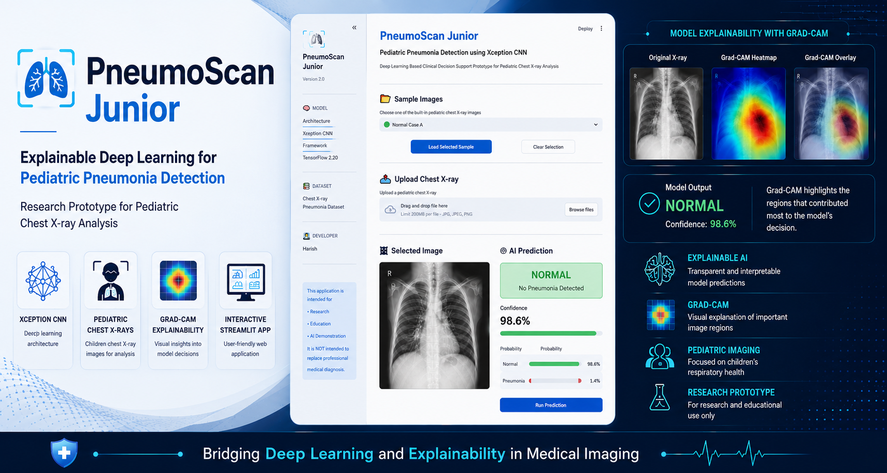

<p align="center">
  
</p>


### **PneumoScan-Junior**
AI-powered web application for automatic pediatric chest X-ray classification using a deep learning model based on **Xception CNN** with **Grad-CAM explainability**, developed for educational and research purposes.


<p align="center">

[](https://www.python.org/)
[](https://www.tensorflow.org/)
[](https://streamlit.io/)
[](LICENSE)

</p>

---

## 📑 Table of Contents

- [Project Overview](#-project-overview)
- [Features](#-features)
- [Application Preview](#-application-preview)
- [Live Demo](#-live-demo)
- [Tech Stack](#-tech-stack)
- [Project Structure](#-project-structure)
- [Getting Started](#-getting-started)
  - [Prerequisites](#prerequisites)
  - [Option A — Run Locally with Python](#option-a--run-locally-with-python)
  - [Option B — Run in Production with Docker](#option-b--run-in-production-with-docker)
  - [Option C — Run in Development with Docker (Live Reload)](#option-c--run-in-development-with-docker-live-reload)
- [Configuration](#-configuration)
- [Makefile Command Reference](#-makefile-command-reference)
- [The Trained Model](#-the-trained-model)
- [Architecture Decisions](#-architecture-decisions)
- [Disclaimer](#-disclaimer)
- [License](#-license)

---

## 📖 Project Overview

Pediatric pneumonia remains one of the leading causes of illness and mortality among children worldwide. Chest X-ray imaging is one of the primary diagnostic tools used to identify pneumonia; however, interpreting radiographs requires clinical expertise and may be challenging in resource-limited settings.

PneumoScan Junior is an end-to-end deep learning application that demonstrates how artificial intelligence can assist in the automated classification of pediatric chest X-ray images. The application integrates a pretrained **Xception Convolutional Neural Network (CNN)** with an interactive Streamlit interface, enabling users to upload chest radiographs and obtain real-time predictions.

Beyond image classification, the application incorporates **Gradient-weighted Class Activation Mapping (Grad-CAM)** to visualize the image regions that most strongly influence the model's prediction. This explainability component provides greater transparency into the decision-making process and helps users better understand how the model reaches its conclusions.

## ✨ Features

- 🩻 **Chest X-ray classification** — upload a pediatric chest radiograph and get a Normal / Pneumonia prediction with a confidence score.
- 🔥 **Grad-CAM explainability** — visual heatmap highlighting the regions that drove the prediction.
- 🖼️ **Built-in sample images** — try the app instantly with bundled Normal and Pneumonia examples.
- 🐳 **Container-ready** — production and development Docker workflows via a single multi-stage Dockerfile.
- ⚡ **Live-reload dev environment** — edit source on the host and see changes without rebuilding the image.

## 📸 Application Preview

**🏠 Home Interface**
> Upload a pediatric chest X-ray or select one of the provided sample images.
<p align="center">
  
</p>

**🤖 AI Prediction**
> The Xception CNN predicts Normal or Pneumonia and reports the associated confidence score.
<p align="center">
  
</p>

**🔥 Explainable AI (Grad-CAM)**
> Grad-CAM highlights the image regions that most influenced the model's prediction.
<p align="center">
  
</p>

## 🌐 Live Demo

**Try the application here:**

**🔗 https://pneumoscan-junior.streamlit.app**

## 🧰 Tech Stack

| Layer | Technology |
| --- | --- |
| Language | Python 3.11 |
| Deep Learning | TensorFlow 2.20 / Keras 3.13 |
| Explainability | Grad-CAM |
| Image Processing | OpenCV (headless), Pillow |
| Web UI | Streamlit 1.49 |
| Containerization | Docker (multi-stage), Docker Compose |

## 📂 Project Structure

```
PneumoScan-Junior/
├── app.py                  # Streamlit entry point
├── config.py               # Central configuration (paths, model info, UI text)
├── model_utils.py          # Model download, loading, and inference
├── explainability.py       # Grad-CAM heatmap generation
├── image_utils.py          # Image loading and preprocessing
├── samples.py              # Bundled sample-image handling
├── ui.py                   # UI components and layout
├── styles.py               # Custom CSS styling
├── requirements.txt        # Python dependencies
├── sample_images/          # Example X-rays (normal / pneumonia)
├── assets/                 # Banner and screenshots
├── Dockerfile              # Multi-stage build (dev + prod targets)
├── docker-compose.yml      # Production service definition
├── docker-compose.dev.yml  # Development override (bind mount + live reload)
├── Makefile                # Build / run / dev shortcuts
└── docs/adr/               # Architecture Decision Records
```

## 🚀 Getting Started

### Prerequisites

- **For local Python:** Python 3.11
- **For Docker:** Docker Engine (or Podman) with Compose (`docker compose` plugin or the standalone `docker-compose` binary — the Makefile auto-detects either)
- **`make`** (optional, but the commands below assume it)

> The ~320 MB trained model is **not** stored in git. It is downloaded
> automatically from GitHub Releases on first use, or baked into the production
> image at build time. See [The Trained Model](#-the-trained-model).

### Option A — Run Locally with Python

For quick local experimentation without Docker:

```bash
# 1. Create and activate a virtual environment
python3.11 -m venv .venv
source .venv/bin/activate        # Windows: .venv\Scripts\activate

# 2. Install dependencies
pip install --upgrade pip
pip install -r requirements.txt

# 3. Run the app (downloads the model on first run)
streamlit run app.py
```

Then open **http://localhost:8501**.

### Option B — Run in Production with Docker

Builds a self-contained, non-root image with the model and source baked in.

```bash
make build      # build the production image
make start      # start the container (detached)
```

Then open **http://localhost:58501** (host port `58501` → container port `8501`).

```bash
make logs       # follow logs
make stop       # stop the container
make remove     # stop and remove the container
```

### Option C — Run in Development with Docker (Live Reload)

Bind-mounts your working directory into the container and enables Streamlit
live-reload, so **code edits are reflected without rebuilding the image**.

```bash
make dev        # build the dev image + run in the foreground (Ctrl-C to stop)
```

Then open **http://localhost:58501**. Edit any `.py` file on your host and the
app reruns automatically.

```bash
make dev-logs   # follow dev logs (if running detached)
make dev-exec   # open a shell inside the dev container
make dev-down   # stop and remove the dev container
```

> Development and production run under **separate Compose projects, image tags,
> and container names**, so they never clash and can even run side by side.
> You only need to rebuild (`make dev`) when dependencies in `requirements.txt`
> change — not for source edits.

## ⚙️ Configuration

### Host port

The host port defaults to `58501` (container always listens on `8501`).
Override it per command:

```bash
make start PORT=9000     # production on http://localhost:9000
make dev   PORT=9000     # development on http://localhost:9000
```

### Build-time variables

Overridable via `--build-arg` (see the header of the [Dockerfile](Dockerfile)):

| Arg | Default | Purpose |
| --- | --- | --- |
| `MODEL_FILENAME` | `Xception_final_gradcam.keras` | Name of the trained model file |
| `MODEL_URL` | GitHub Releases URL | Where to download the model if it is missing locally |
| `APP_PORT` | `8501` | Port Streamlit listens on inside the container |

Override them at build time with `--build-arg`:

```bash
# With docker build
docker build \
  --build-arg APP_PORT=8501 \
  --build-arg MODEL_FILENAME=my_model.keras \
  --build-arg MODEL_URL=https://example.com/releases/my_model.keras \
  -t pneumoscan-junior:latest .

# With docker compose (the same flag works)
docker compose build --build-arg APP_PORT=8501

# Via the Makefile — production
make build APP_PORT=8501 PORT=58501 BUILD_ARGS="--build-arg MODEL_FILENAME=my_model.keras"

# Via the Makefile — development
make dev APP_PORT=8501 PORT=58501 BUILD_ARGS="--build-arg MODEL_FILENAME=my_model.keras"
```

### Cross-platform builds

```bash
make build PLATFORM=linux/amd64   # cross-build for x86_64 hosts
make build NO_CACHE=1             # force a clean rebuild
```

## 📋 Makefile Command Reference

Run `make help` to see this list at any time.

| Command | Description |
| --- | --- |
| `make build` | Build the production Docker image |
| `make start` | Start the application (detached) |
| `make stop` | Stop the running container |
| `make remove` | Stop and remove the container |
| `make restart` | Restart the application |
| `make logs` | Follow application logs |
| `make exec` | Open a shell inside the running container |
| `make clean` | Remove the container and image |
| `make dev` | Build + run the dev container with live reload (foreground) |
| `make dev-down` | Stop and remove the dev container |
| `make dev-logs` | Follow dev container logs |
| `make dev-exec` | Open a shell inside the dev container |

## 🧠 The Trained Model

The Xception model (`Xception_final_gradcam.keras`, ~320 MB) is **gitignored**
and resolved in one of three ways:

1. **Local file present** — used as-is (fastest; no download).
2. **Production build** — the Dockerfile's `model` stage uses the local file if
   present, otherwise downloads it from GitHub Releases at build time and bakes
   it into the image.
3. **Runtime fallback** — `model_utils.py` downloads it from GitHub Releases on
   first use if it is not already available.

This means the app works whether or not you already have the model on disk.

## 📐 Architecture Decisions

Significant architectural choices are recorded as ADRs in
[`docs/adr/`](docs/adr/), including
[why dev and prod share a single multi-stage Dockerfile](docs/adr/0001-single-multistage-dockerfile-for-dev-and-prod.md).

## ⚠️ Disclaimer

PneumoScan Junior is intended **for educational and research purposes only**.
It is **not** a medical device and **must not** be used for clinical diagnosis or treatment decisions.

## 📄 License

Released under the **MIT License**. A `LICENSE` file should be added to the
repository root to make this explicit (the badge above links to it).
